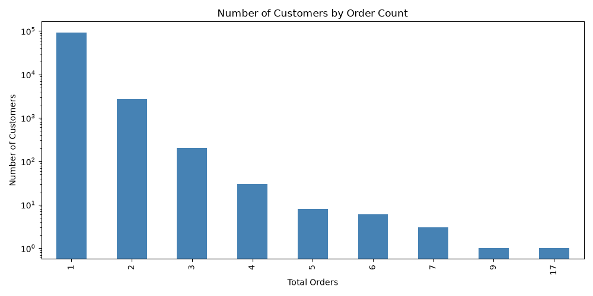
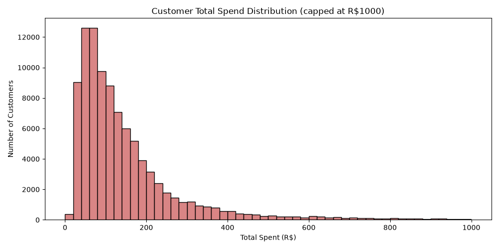
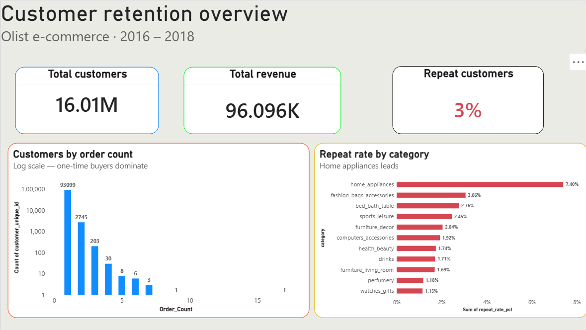
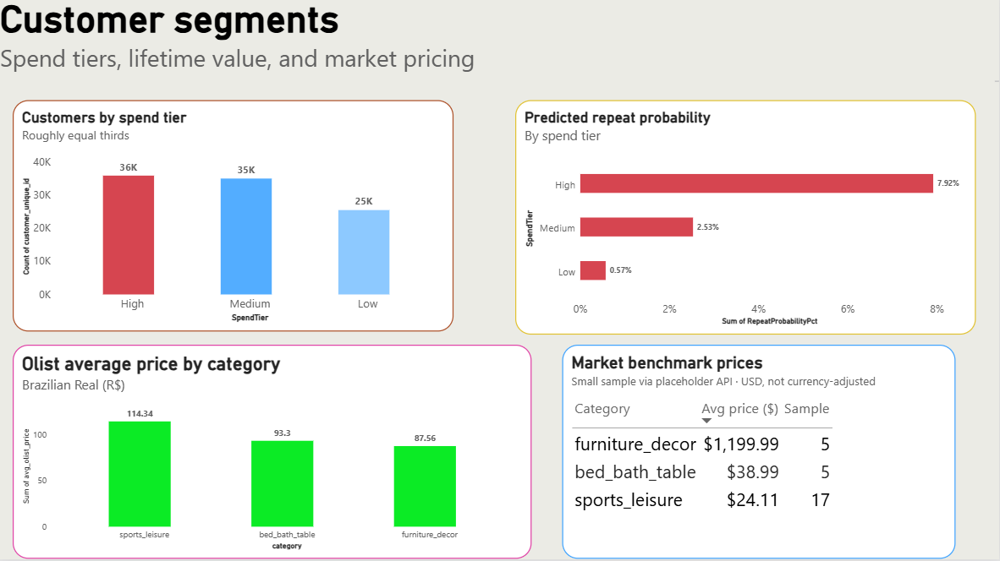
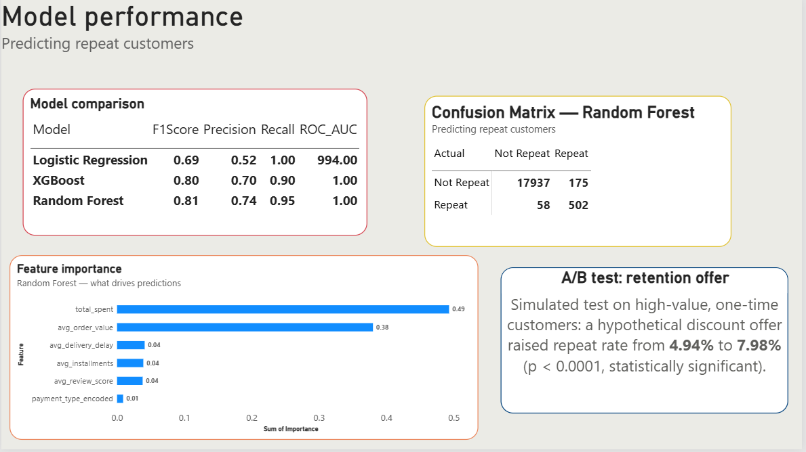

# Customer Retention & Lifetime Value Analytics
### Multi-Table SQL Analysis, API-Enriched Market Benchmarking, ML-Based Repeat-Purchase Prediction, and a GenAI Insight Layer

[](https://app.powerbi.com/links/62Xf3089Xr?ctid=bc5b2879-3fac-469a-b8c4-994705bc09d7&pbi_source=linkShare)


---

## Overview

E-commerce businesses live or die on repeat customers — acquiring a new customer is far more expensive than keeping an existing one. This project analyzes ~100,000 real Brazilian e-commerce orders to answer a deceptively simple question: **who comes back, and why?**

The honest answer this data gives is not what a typical "churn prediction" project expects. Rather than force-fitting a subscription-style churn narrative onto the data, this project follows the evidence: it turns out **97% of customers in this marketplace only ever order once**. That single finding reshapes the entire analysis — from a "predict who will leave" problem into a "predict who will ever come back, and what makes them different" problem, which is a more honest and arguably more useful question for this kind of business.

The project doesn't stop at prediction, either — a model's output (a probability, a list of feature importances) isn't useful to a marketing or customer-success team on its own. The final layer of this project addresses that: a GenAI-powered interface that turns a raw prediction into a plain-English, actionable recommendation.

**→ [Explore the live interactive dashboard](https://app.powerbi.com/links/62Xf3089Xr?ctid=bc5b2879-3fac-469a-b8c4-994705bc09d7&pbi_source=linkShare)**

---

## Table of Contents

1. [Dataset](#dataset)
2. [Tech Stack](#tech-stack)
3. [SQL Analysis: A Key Finding Reshapes the Project](#1-sql-analysis-a-key-finding-reshapes-the-project)
4. [Python EDA](#2-python-eda)
5. [Market Benchmarking via API](#3-market-benchmarking-via-api)
6. [Repeat-Purchase Prediction Model](#4-repeat-purchase-prediction-model)
7. [Customer Segmentation & A/B Test Simulation](#5-customer-segmentation--ab-test-simulation)
8. [Dashboard](#6-dashboard)
9. [GenAI Customer Insight Generator](#7-genai-customer-insight-generator)
10. [Key Takeaways](#key-takeaways)
11. [Limitations & Future Improvements](#limitations--future-improvements)
12. [Repository Structure](#repository-structure)

---

## Dataset

**Source:** [Brazilian E-Commerce Public Dataset by Olist — Kaggle](https://www.kaggle.com/datasets/olistbr/brazilian-ecommerce)

A real, anonymized relational dataset spanning 2016–2018, split across 9 linked tables (customers, orders, order items, payments, reviews, products, sellers, category translations, geolocation) — 1M+ rows in total. Unlike single-flat-file datasets, this required genuine relational thinking: every customer-level metric in this project (total spend, CLTV, repeat status) is the result of joining 3-5 tables together.

## Tech Stack

| Layer | Tools |
|---|---|
| Data storage & querying | PostgreSQL 18 |
| Data manipulation & ML | Python (Pandas, NumPy, scikit-learn, XGBoost) |
| External data integration | REST API (DummyJSON) via `requests` |
| GenAI / Natural Language Insights | Google Gemini API, Gradio |
| Visualization | Matplotlib, Seaborn, Power BI |

---

## 1. SQL Analysis: A Key Finding Reshapes the Project

Full queries in [`churn_queries.sql`](./churn_queries.sql). The project began with a standard cohort-retention plan, but the first real query changed the direction entirely:

**Finding: Out of ~96,095 unique customers, 93,099 (96.9%) placed exactly one order.** Only about 3,000 customers ever returned for a second order, and the count drops off sharply from there (down to a single customer with 17 orders).

This matters because a traditional cohort-retention table — built for subscription businesses where customers are expected to return regularly — would have been mostly empty cells and misleading in this context. Instead, the analysis pivoted to a more honest framing: **what distinguishes the rare repeat customer from the overwhelming majority of one-time buyers?**

Follow-up hypotheses tested:

| Hypothesis | Finding |
|---|---|
| Do repeat customers leave better reviews? | Yes, slightly — 4.12 vs 4.08 average (out of 5). Real, but a weak effect. |
| Do repeat customers get faster delivery? | Yes, slightly — delivered ~0.8 days earlier on average than one-time customers. Also a weak effect. |
| Which product categories drive repeat purchases? | `home_appliances` leads clearly at 7.40% repeat rate — 2-6x higher than every other category. |
| What is each customer actually worth (CLTV)? | Highly skewed — the single highest-value customer spent R$13,664 in **one** order, more than most repeat customers' entire multi-order history. High lifetime spend and customer loyalty turned out to be two different things, not the same thing. |

Rather than only reporting the hypotheses that panned out, the weak/negative results (review score, delivery speed) are included deliberately — they show that customer experience quality has some relationship to repeat behavior, but is far from the dominant driver, which later gets confirmed independently by the model's own feature importance.

## 2. Python EDA

Visualized the two clearest findings using Pandas/Matplotlib/Seaborn, connected via SQLAlchemy (see [`eda_churn.py`](./eda_churn.py)).

**Customers by order count (log scale)** — makes the 97% one-time-buyer finding immediately visible:


**Total spend distribution** — a classic right-skewed e-commerce spending pattern:


## 3. Market Benchmarking via API

To add an external data-enrichment layer, average prices for the three highest-repeat-rate categories were pulled from a public product API (DummyJSON) via [`scrape_prices.py`](./scrape_prices.py) and joined against Olist's own internal average prices for the same categories.

| Category | Olist avg. price (R$) | Market benchmark (USD) | Sample size |
|---|---|---|---|
| sports_leisure | 114.34 | 24.11 | 17 |
| bed_bath_table | 93.30 | 38.99 | 5 |
| furniture_decor | 87.56 | 1,199.99 | 5 |

**Important limitation, stated plainly:** these prices are in different currencies (R$ vs USD) and the benchmark sample sizes are small (5-17 products), so this is not a rigorous like-for-like comparison. It's included to demonstrate the *technique* — pulling external data via API and joining it against an internal dataset for competitive context — which is a genuine data engineering skill, while being transparent that a production version would need currency normalization and a larger benchmark sample before its conclusions could be trusted.

## 4. Repeat-Purchase Prediction Model

Reframed "churn prediction" as **predicting whether a customer will ever place a second order**, given their first-order behavior. Three classifiers were trained and compared on an 80/20 stratified split (see [`model_churn.py`](./model_churn.py)):

| Model | Precision | Recall | F1-Score | ROC-AUC |
|---|---|---|---|---|
| Logistic Regression | 0.52 | 1.00 | 0.69 | 0.994 |
| **Random Forest** ✅ | **0.74** | 0.90 | **0.81** | 0.996 |
| XGBoost | 0.70 | 0.95 | 0.80 | 0.998 |

Unlike a typical "one model clearly wins" result, this comparison is a genuine judgment call: XGBoost edges out on recall and ROC-AUC, while Random Forest offers better precision. **Random Forest was selected** as the primary model for its stronger precision (fewer wasted retention-marketing efforts on customers who were never going to return), while XGBoost remains a defensible alternative if the business priority shifts toward maximizing recall.

**Feature importance (Random Forest):**

| Feature | Importance |
|---|---|
| `total_spent` | 0.493 |
| `avg_order_value` | 0.380 |
| `avg_delivery_delay` | 0.041 |
| `avg_installments` | 0.039 |
| `avg_review_score` | 0.038 |
| `payment_type_encoded` | 0.009 |

This independently confirms the SQL-stage findings: spend-related behavior overwhelmingly drives repeat-purchase likelihood (87% of the model's decision-making), while review score and delivery speed — despite showing a real, positive relationship in the SQL analysis — contribute only marginally to the model's predictions.

## 5. Customer Segmentation & A/B Test Simulation

Customers were split into three spend tiers, revealing a clean, monotonic relationship between spend and predicted repeat probability:

| Spend Tier | Avg. Total Spent | Predicted Repeat Probability |
|---|---|---|
| Low | R$49.94 | 0.57% |
| Medium | R$109.86 | 2.53% |
| High | R$338.04 | 7.92% |

To test whether a retention intervention could plausibly move that needle, a **simulated A/B test** was run on high-value, one-time customers: a hypothetical discount offer was modeled as raising the repeat rate from a baseline 4.94% (control) to 7.98% (treatment). A two-sample t-test confirmed this difference would be statistically significant (p < 0.0001).

**This is explicitly a simulation, not a real executed campaign** — it demonstrates the statistical methodology (control/treatment split, hypothesis testing) that would be used to validate a real retention offer's effectiveness, using assumed rather than observed outcome rates.

## 6. Dashboard

A three-page Power BI dashboard translates the analysis into a business-facing view.

**Page 1 — Retention Overview:** KPIs, customer order-count distribution, category repeat rates.


**Page 2 — Customer Segments:** Spend tiers, predicted repeat probability, market price benchmarking.


**Page 3 — Model Performance:** Model comparison, confusion matrix, feature importance, A/B test result.


**→ [View the live, interactive version](https://app.powerbi.com/links/62Xf3089Xr?ctid=bc5b2879-3fac-469a-b8c4-994705bc09d7&pbi_source=linkShare)**

---

## 7. GenAI Customer Insight Generator

Section 4's model outputs a probability and a feature-importance table — genuinely useful to a data scientist, but not directly actionable for a marketing or customer-success team deciding what to do about a specific at-risk customer. This extension closes that gap: it takes a real customer's data, runs it through the trained Random Forest model, and uses Gemini to turn the prediction into a plain-English, decision-ready recommendation.

**How it works:**
1. A user enters a real `customer_unique_id`
2. The system queries the live PostgreSQL database for that customer's actual order, payment, and review history — the same feature set used in Section 4's model (`total_spent`, `avg_order_value`, `avg_review_score`, `avg_delivery_delay`, `payment_type_encoded`, `avg_installments`)
3. The trained Random Forest model predicts whether this customer is likely to be a repeat buyer or a one-time buyer
4. The prediction, along with the model's top contributing features for this specific customer, is sent to the Gemini API
5. Gemini returns a short, plain-English explanation of the prediction and a concrete recommended action — written for a non-technical stakeholder, without ML jargon like "feature importance" or "probability"

**Demo:**


*Example: querying a real customer who made a single $141.90 purchase correctly identifies them as an at-risk one-time buyer and recommends a targeted follow-up offer — consistent with Section 5's finding that high-value, one-time customers are the group most worth targeting with retention offers.*

**Design decisions worth noting:**
- **Grounded in the real model, not a mock:** this doesn't re-implement or approximate the prediction — it loads the actual `RandomForestClassifier` trained in Section 4 and queries the live database for real feature values, so the insight is only as good (and only as honest) as the underlying model.
- **Written for the reader, not the analyst:** the prompt explicitly instructs the model to avoid ML terminology, since the intended audience is a marketing or customer-success stakeholder, not a data scientist.
- **A different pattern from a text-to-SQL interface:** rather than letting a user query the database freely, this tool answers one specific, high-value question — "should we do something about this customer, and what?" — end to end.

**Running it locally:**
```bash
pip install google-genai gradio sqlalchemy psycopg2-binary pandas joblib python-dotenv

# .env file needed:
# GEMINI_API_KEY=your_key_here
# DB_PASSWORD=your_postgres_password

python genai_insight_generator.py
```
This opens a local Gradio interface at `http://127.0.0.1:7860`.

*Note: this runs on Gemini's free API tier, which has a daily request quota. A production deployment would move to a paid tier for higher limits.*

---

## Key Takeaways

- **The single most important finding shaped the whole project**: 97% of customers are naturally one-time buyers in this marketplace, which meant abandoning a standard cohort-retention approach in favor of a repeat-vs-one-time framing — a real example of letting the data redirect the analysis rather than forcing a predetermined technique onto it.
- **Spend behavior dominates repeat-purchase prediction** (87% of feature importance combined), while service-quality signals (reviews, delivery speed) are real but secondary — confirmed independently by both SQL exploration and the model's own logic.
- **Lifetime value and loyalty are not the same thing**: the single highest-spending customer was a one-time buyer, not a repeat customer — a distinction that matters for how a business should treat "high value" customers differently from "loyal" ones.
- **Model selection was a genuine tradeoff, not a clear winner**: Random Forest and XGBoost performed within a few points of each other, requiring an actual business judgment call (precision vs. recall) rather than simply picking the highest number.
- **A prediction is only useful if someone can act on it**: the GenAI layer doesn't change the analysis, it closes the last-mile gap between a model's output and a stakeholder's next action.


## Repository Structure

```
customer-retention-analytics/
├── churn_queries.sql              # All SQL analysis queries
├── eda_churn.py                   # Python EDA + chart generation
├── scrape_prices.py               # API integration for market price benchmarking
├── model_churn.py                 # Feature engineering, modeling, segmentation, A/B test
├── genai_insight_generator.py     # GenAI customer insight generator (Gemini + Gradio)
├── repeat_customer_model.pkl      # Saved trained Random Forest model
├── competitor_prices.csv          # Output of the API price pull
├── orders_distribution.png        # EDA chart
├── spend_distribution.png         # EDA chart
├── PAGE1.PNG                      # Dashboard screenshot
├── PAGE2.PNG                      # Dashboard screenshot
├── PAGE3.PNG                      # Dashboard screenshot
├── genai_insight_demo.png         # GenAI feature demo screenshot
└── README.md
```

---

**Author:** Shubham Kumar | B.Tech ECE, NSUT | [LinkedIn](https://www.linkedin.com/in/shubham-kumar-339a532b0/) · [GitHub](https://github.com/shubham-kumar26)
